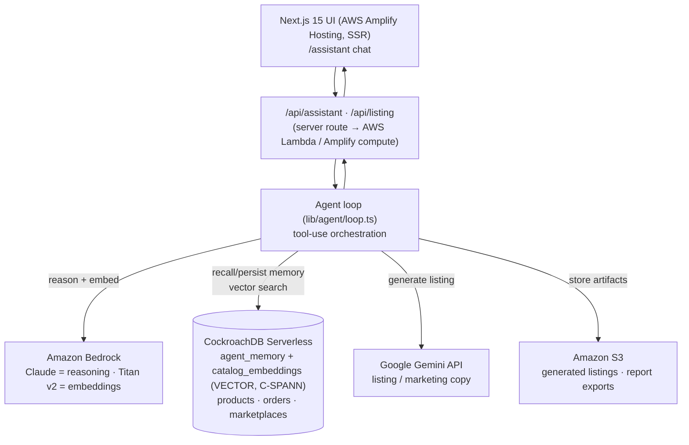

# ProSellerOS Copilot — Architecture

The copilot turns ProSellerOS's simulated assistant into a real **agentic
seller-assistant** with a **persistent CockroachDB memory layer**, executed on
**AWS**, with one deployed **Google Gemini** call for the AI-business track.

## Request flow (one copilot turn)

1. UI `POST /api/assistant { prompt, sessionId, history, path }`
   ([app/api/assistant/route.ts](../app/api/assistant/route.ts)). `history` is the
   operator's open-window transcript — the copilot's working memory.
2. Embed the prompt and persist the user turn to `agent_memory`
   ([lib/agent/memory.ts](../lib/agent/memory.ts)).
3. Recall memory: semantic recall over `agent_memory` (C-SPANN), scoped to the
   current session, for context that has fallen out of the replayed transcript.
4. Tool-use loop ([lib/agent/loop.ts](../lib/agent/loop.ts)) over **real SQL** on
   CockroachDB, in two families:
   - *Read* ([lib/agent/tools.ts](../lib/agent/tools.ts)) — declining products,
     inventory forecast, profit summary, pricing, order search/stats, semantic
     catalog search, Gemini listing generation.
   - *Act* ([lib/agent/ops.ts](../lib/agent/ops.ts)) — accept/pack/ship/cancel
     orders, print labels, export CSVs, create orders, re-price, restock,
     navigate. Each writes to CockroachDB **and** returns a `ClientAction`.
5. Tool results (incl. a UI widget) go back to the model; it writes the answer.
6. Stream `text` / `widget` / `action` events as they happen, persist the
   assistant turn to `agent_memory`, and end with `done`.

The browser applies each `ClientAction` ([lib/agent/actions.ts](../lib/agent/actions.ts))
to the live OS surface — router, order/product stores, downloads, theme — so one
turn both decides and does. See [components/copilot/](../components/copilot/).

If CockroachDB or the LLM provider aren't configured, the route falls back to the
deterministic mock `answer()` so the app always runs (demo-safe).

## Memory lifetime

Two layers, deliberately different in lifetime:

| Layer | Lives in | Lasts |
|---|---|---|
| Working memory (the transcript replayed as conversation turns) | `CopilotProvider` React state | The operator's open window; a reload or **New chat** resets it |
| Recall (embedded turns, C-SPANN vector search) | `agent_memory` in CockroachDB | Rows persist for audit, but recall is **scoped to the session id**, so a new window cannot reach an old one |

That combination is what gives the demo a copilot that genuinely remembers the
conversation you are having, and genuinely forgets it when you close the window.

## Hackathon A — CockroachDB tools used (need ≥2 → we use 3)

| Tool | Where | What the agent does with it |
|---|---|---|
| **Distributed Vector Indexing (C-SPANN)** | `catalog_embeddings`, `agent_memory` `VECTOR(1024)` + vector indexes ([db/schema.sql](../db/schema.sql)) | Semantic RAG over catalog/insights and long-term memory recall — real-time, transactionally fresh |
| **Managed MCP Server** | Read-only cluster connection in Claude Code | Agent introspects schema/data during dev; live "agent queries its own memory" demo |
| **ccloud CLI** | Provisioning | Create the Serverless cluster, SQL service account, backups |

## Hackathon A — AWS services used (need ≥1 → we use 4)

| Service | Where | Role |
|---|---|---|
| **AWS Lambda** | `/api/*` via Amplify compute | Serverless agent execution |
| **Amazon Bedrock** | [lib/ai/bedrock.ts](../lib/ai/bedrock.ts) | Claude reasoning + Titan v2 embeddings |
| **Amazon S3** | [lib/ai/s3.ts](../lib/ai/s3.ts) | Generated listings + report exports |
| **AWS Amplify Hosting** | [amplify.yml](../amplify.yml) | Deploys the Next.js 15 SSR app on AWS |

## Hackathon B — Google Cloud + Gemini

- **Gemini API** ([lib/ai/gemini.ts](../lib/ai/gemini.ts)) powers the deployed
  listing/marketing generator — satisfies "≥1 Gemini LLM call in the deployed app"
  and "≥1 Google Cloud product." Reachable both as an agent tool and directly via
  `POST /api/listing`.
- Revenue/user evidence is the business track — see
  [SUBMISSION.md](./SUBMISSION.md).

## Cost fit ($100 AWS credits)

Bedrock is pay-per-token (cents for a demo), Lambda is within free tier, S3 is
pennies, Amplify hosting is low-cost. CockroachDB is covered by your CockroachDB
credits. $100 comfortably covers the build + demo + a live judging window.
