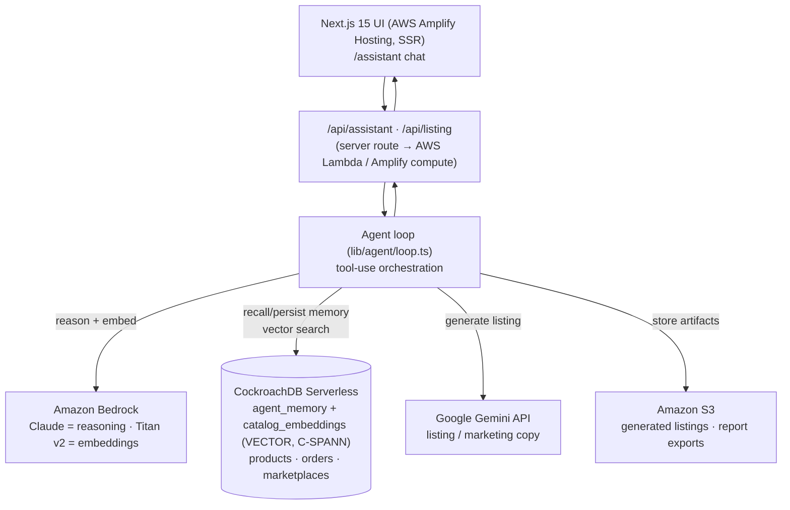

# ProSellerOS Copilot — Architecture

The copilot turns ProSellerOS's simulated assistant into a real **agentic
seller-assistant** with a **persistent CockroachDB memory layer**, executed on
**AWS**, with one deployed **Google Gemini** call for the AI-business track.

## Request flow (one copilot turn)

1. UI `POST /api/assistant { prompt, sessionId }` ([app/api/assistant/route.ts](../app/api/assistant/route.ts)).
2. Embed the prompt with **Titan v2** and persist the user turn to
   `agent_memory` ([lib/agent/memory.ts](../lib/agent/memory.ts)).
3. Recall memory: semantic recall over `agent_memory` (C-SPANN) + recent session
   turns → injected into the system prompt.
4. **Bedrock Converse** tool-use loop ([lib/agent/loop.ts](../lib/agent/loop.ts)):
   Claude picks tools that run **real SQL** over CockroachDB
   ([lib/agent/tools.ts](../lib/agent/tools.ts)) — declining products, inventory
   forecast, profit summary, pricing, semantic catalog search, and Gemini listing
   generation.
5. Tool results (incl. a UI widget) go back to Claude; it writes the final answer.
6. Persist the assistant turn (embedded) to `agent_memory`; return
   `{ text, widget, followups }` — the exact shape the existing UI renders.

If CockroachDB or Bedrock aren't configured, the route falls back to the
deterministic mock `answer()` so the app always runs (demo-safe).

## Hackathon A — CockroachDB tools used (need ≥2 → we use 3)

| Tool | Where | What the agent does with it |
|---|---|---|
| **Distributed Vector Indexing (C-SPANN)** | `catalog_embeddings`, `agent_memory` `VECTOR(1024)` + vector indexes ([db/schema.sql](../db/schema.sql)) | Semantic RAG over catalog/insights and long-term memory recall — real-time, transactionally fresh |
| **Managed MCP Server** | Read-only cluster connection in Claude Code | Agent introspects schema/data during dev; live "agent queries its own memory" demo |
| **ccloud CLI** | Provisioning | Create the Serverless cluster, SQL service account, backups |

## Hackathon A — AWS services used (need ≥1 → we use 4)

| Service | Where | Role |
|---|---|---|
| **AWS Lambda** | `/api/*` via Amplify compute | Serverless agent execution |
| **Amazon Bedrock** | [lib/ai/bedrock.ts](../lib/ai/bedrock.ts) | Claude reasoning + Titan v2 embeddings |
| **Amazon S3** | [lib/ai/s3.ts](../lib/ai/s3.ts) | Generated listings + report exports |
| **AWS Amplify Hosting** | [amplify.yml](../amplify.yml) | Deploys the Next.js 15 SSR app on AWS |

## Hackathon B — Google Cloud + Gemini

- **Gemini API** ([lib/ai/gemini.ts](../lib/ai/gemini.ts)) powers the deployed
  listing/marketing generator — satisfies "≥1 Gemini LLM call in the deployed app"
  and "≥1 Google Cloud product." Reachable both as an agent tool and directly via
  `POST /api/listing`.
- Revenue/user evidence is the business track — see
  [SUBMISSION.md](./SUBMISSION.md).

## Cost fit ($100 AWS credits)

Bedrock is pay-per-token (cents for a demo), Lambda is within free tier, S3 is
pennies, Amplify hosting is low-cost. CockroachDB is covered by your CockroachDB
credits. $100 comfortably covers the build + demo + a live judging window.
