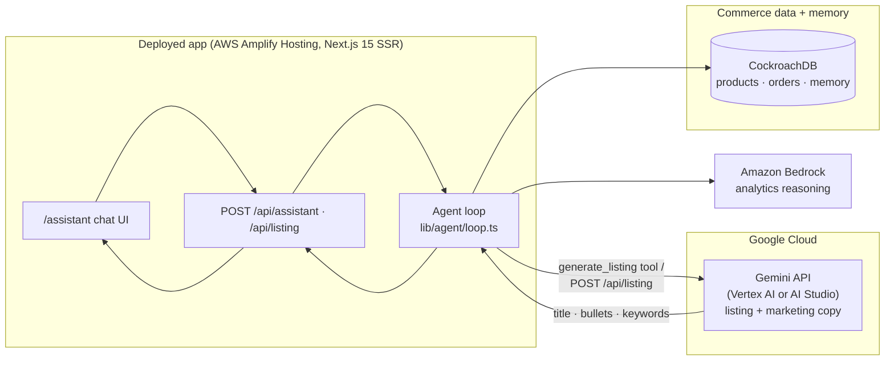

# Hackathon B — hacker.fund / Google Cloud (AI business) submission

Category: **Small Business Services / Entrepreneurship.** ProSellerOS is an AI
business whose seller copilot uses **Google Gemini** for its listing/marketing
generation. This doc holds the two submission assets: the **Gemini-centric
architecture diagram** and the **revenue + evidence checklist** you fill in.

> Numbers below are blanks marked `⟨fill⟩`. Do **not** fabricate — the event
> requires verifiable proof (bank/Stripe records, dashboards, logs). Enter your
> real figures and attach the backing evidence.

---

## 1. How AI transforms the workflow (text description — YOU refine)

Multi-marketplace sellers lose hours to manual analysis and copywriting.
ProSellerOS replaces that with one conversational copilot:

- **Ask, don't dig.** "Which products are declining and why?" runs real SQL over
  live sales data and answers in seconds — no spreadsheets.
- **Gemini writes the storefront.** "Generate a listing for my bestseller" calls
  **Gemini** to produce SEO-optimized, benefit-led titles/bullets/keywords ready
  to publish across channels.
- **It remembers the session.** The copilot keeps the working conversation for as
  long as the seller's window is open, so "accept them, then print their labels"
  resolves against what was just discussed — and forgets it on close.
- **It does the work.** Beyond answering, it accepts and ships orders, downloads
  print-ready labels, re-prices SKUs, exports reports, and navigates the seller
  straight to the screen in question — each action leaving an undoable receipt.

The AI is the product: it turns raw commerce data into decisions and published
content a solo seller could not produce at that speed.

---

## 2. Architecture — Gemini + Google Cloud in the deployed app

**Where Gemini runs:** [lib/ai/gemini.ts](../lib/ai/gemini.ts) →
`generateListingCopy()`, reached as the copilot's `generate_listing` tool and
directly via `POST /api/listing`. This satisfies both Hackathon B requirements:
**≥1 Google Cloud product** and **≥1 Gemini LLM call in the deployed app**.

**Auth modes** ([lib/config.ts](../lib/config.ts)):
- **Vertex AI** (`GEMINI_USE_VERTEX=true`) — a real Google Cloud product billed to
  your GCP project via ADC. Recommended for this event.
- **Developer API** — `GEMINI_API_KEY` from AI Studio (free tier).

---

## 3. Revenue evidence (required, USD — YOU fill + attach proof)

All figures in USD, from **arms-length third-party** customers unless noted.
Attach the source (Stripe/marketplace payout export, bank statement) for each.

| Item | Amount (USD) | Backing evidence (attach) |
|---|---|---|
| Total third-party revenue (to date) | `⟨fill⟩` | `⟨Stripe/bank export⟩` |
| Revenue — **May 2026** | `⟨fill⟩` | `⟨payout report⟩` |
| Revenue — **June 2026** | `⟨fill⟩` | `⟨payout report⟩` |
| Revenue — **July 2026** | `⟨fill⟩` | `⟨payout report⟩` |
| Revenue — **August 2026** | `⟨fill⟩` | `⟨payout report⟩` |
| **Related-party** revenue (report separately) | `⟨fill / 0⟩` | `⟨note relationship⟩` |

### Costs & spend (disclose even if zero)

| Item | Amount (USD) | Notes |
|---|---|---|
| Total expenses | `⟨fill⟩` | sum of the rows below |
| — Hosting (AWS Amplify, S3, CockroachDB) | `⟨fill⟩` | AWS + CockroachDB invoices |
| — AI API usage (Bedrock + Gemini) | `⟨fill⟩` | Bedrock + Google Cloud billing |
| — Contractor / other fees | `⟨fill⟩` | |
| Marketing / CAC spend | `⟨fill / 0⟩` | **disclose even if zero** |

### Derived (optional, only if you have the inputs)

| Metric | Value | How |
|---|---|---|
| Net (revenue − expenses) | `⟨fill⟩` | |
| Gross margin % | `⟨fill⟩` | |
| MoM growth (May→Aug) | `⟨fill⟩` | |

---

## 4. User evidence (YOU fill)

| Item | Value / attachment |
|---|---|
| Number of users | `⟨fill⟩` |
| Who they are (segment, geography) | `⟨fill⟩` |
| Testimonials / feedback | `⟨attach — users must be aware their info is shared⟩` |

---

## 5. Product-running evidence (YOU attach)

Proof the AI product actually runs for real users:

- **Agent execution logs** — CloudWatch logs for `/api/assistant` and
  `/api/listing` (search `[assistant]` / listing generation).
- **AI usage records** — Bedrock invocation metrics + Google Cloud / AI Studio
  Gemini usage dashboard.
- **Live URL** — the Amplify app URL (see [DEPLOY.md](./DEPLOY.md)).
- **Memory-at-work** — `SELECT role, left(content,60), created_at FROM
  agent_memory ORDER BY created_at DESC LIMIT 5;` after a live session.

---

## 6. Submission logistics (YOU)

- [ ] Category selected: Small Business Services / Entrepreneurship.
- [ ] Text description of how AI transforms the workflow (section 1, refined).
- [ ] Revenue evidence table complete + proof attached (section 3).
- [ ] User evidence + testimonials (section 4).
- [ ] Product-running evidence (section 5).
- [ ] Corporate ID, if submitting as an organization.

> Reusing one codebase across two events can touch each event's "newly created
> during the submission period" rule. Frame this submission on its own merits and
> disclose shared/pre-existing work as the event requires. See
> [SUBMISSION.md](./SUBMISSION.md).
